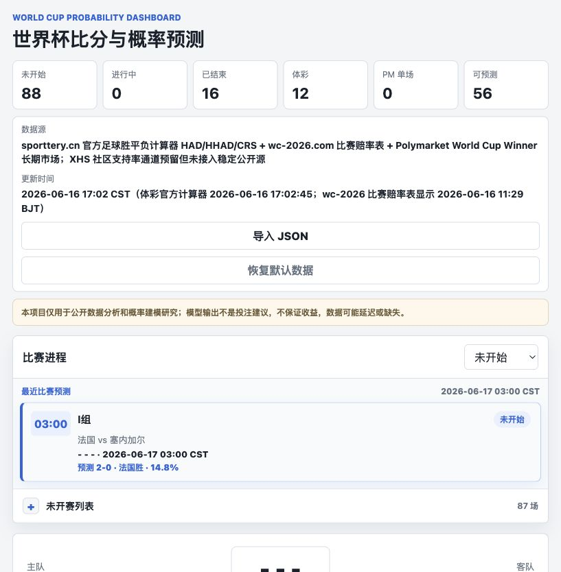

# World Cup Probability Dashboard

> Research-only World Cup probability dashboard and odds comparison toolkit.
> It is not betting advice, financial advice, or an automated betting system.

这个项目最初用于整理 Polymarket、体彩和公开赔率数据，做世界杯比赛概率与比分预测分析。现在包含两部分：

- 静态前端看板：展示赛程、比分预测、体彩 HAD/HHAD/CRS、wc-2026 参考赔率、虎扑近期赛程校验与公开热度、PANews AI Arena 外部 AI 观点、Polymarket 长期市场和模型概率。
- Python 研究工具：把固定奖金赔率和预测市场价格统一成同一个成本口径，用于分析概率差异和理论套利条件。

## Demo

- GitHub Pages: <https://nelson121304yjm-bit.github.io/worldcup-probability-dashboard/>
- Local dashboard: `web/index.html`



Python 工具里的成本口径是：

> 为某个互斥且完备的结果锁定 1 元基础货币返还，需要付出多少成本。

当所有结果的最低锁定成本相加小于 1 时，才存在理论上的无风险套利。项目默认只分析，不自动下单、不出票、不连接交易账户。

## 免责声明

- 本项目仅用于数据分析、概率建模和软件工程研究。
- 页面中的“推荐”“价值差”“理论期望”都是模型输出，不代表确定收益，也不是投注建议。
- 赔率、盘口、数据源和赛事状态可能延迟、缺失或变更。
- 使用者需要自行确认所在地法律、平台条款、彩票规则和税费规则。
- 项目不会绕过登录、反爬、付费墙或平台访问限制。
- 虎扑目前只作为公开赛程/赛果校验与热度/评分人数来源，不提供赔率或支持率，不参与模型计权。
- PANews AI Arena 只作为外部 AI 交易观点/持仓快照展示，不参与本站模型计权，也不代表确定预测。

## 关键假设

- 结果集合必须互斥且完备，例如一场比赛的 `home/draw/away`，或世界杯冠军的所有候选项加 `other`。
- 体彩十进制赔率按固定奖金处理：投注 `stake`，命中后返还 `stake * odds`。示例按常见 2 元步进和单注中奖超过 10000 元按 20% 个税建模，实盘前要按当地出票和兑奖规则确认。
- Polymarket YES 份额命中后返还 `1 USDC`，买入成本使用盘口 ask 深度、taker fee、滑点和汇率换算。CLOB 盘口和 Gamma event 快照来自 Polymarket 公共 API。
- 体彩税费、Polymarket 交易费、USDC/CNY 汇率、提现或换汇成本都需要显式写入输入文件。
- 模型不会判断某个市场是否合法可交易；下单前必须自己确认所在地法律、平台限制和彩票规则。

## 快速运行

运行测试：

```bash
python3 -m pytest
```

未安装包时：

```bash
PYTHONPATH=src python -m worldcup_arb analyze examples/world_cup_sample.json --target-payout 1000
PYTHONPATH=src python -m worldcup_arb table examples/world_cup_sample.json --target-payout 100
PYTHONPATH=src python -m worldcup_arb optimize examples/world_cup_sample.json --budget 10000
```

安装为包后：

```bash
pip install -e .
worldcup-arb analyze examples/world_cup_sample.json --target-payout 1000
```

## 前端看板

静态 UI 位于 `web/`，可以直接打开：

```bash
open web/index.html
```

或启动本地静态服务：

```bash
python3 -m http.server 8765
```

然后打开 `http://localhost:8765/web/index.html`。

看板包含比赛进程、比分、关键事件、sporttery.cn 官方 HAD/HHAD/CRS 赔率、wc-2026.com 参考赔率、虎扑近期赛程校验与公开热度、Polymarket YES 价格、公开数据折算的球队/球员表现指标和预测胜率 edge。前端不内置虚构比赛；默认读取 `web/data/matches.js`，也可以在页面里导入真实 JSON。页面只展示当前真的抓到的价格，缺失盘口会明确标注为未匹配。

比分预测使用两层概率：

- 模型概率：胜平负市场共识、球队表现评分和泊松比分分布。
- 融合概率：如果有体彩 CRS 比分盘，会把体彩比分赔率去水后按 `模型 55% / 体彩比分盘 45%` 融合。

这个权重只是当前研究参数，发布前后都应该通过历史比赛回测重新校准。

## 模型回测与校准

已有完赛比分可以用来优化模型，但需要分层处理：

- 已完赛比分可以校验总进球、平局率、主客胜分布和常见比分。
- 胜平负市场权重、球队表现权重、体彩 CRS 融合权重，必须依赖赛前赔率快照；不能用完赛后已经缺失的盘口倒推或补造。
- 当前脚本只给校准建议，不会在样本不足时自动改前端参数，避免小样本过拟合。

运行回测报告：

```bash
python3 scripts/backtest_model.py
```

从现在开始，`scripts/fetch_sporttery.py` 会在比赛从未完赛变成已完赛之前保存 `closingSnapshot`，包括当时已抓到的胜平负赔率、体彩 HAD/HHAD/CRS 和来源信息。后续比赛完赛后，这些快照会进入回测池，用于更可靠地校准模型参数。

## 数据更新

当前仓库内置的是静态快照。GitHub Pages 不会自己改数据；自动刷新由 GitHub Actions 定时运行 `scripts/fetch_sporttery.py` 完成。

自动更新当前只做保守刷新：

- 从 Sporttery 官方公开足球接口读取计算器赔率，并尝试读取赛果。
- 如果 Sporttery 赛果接口被 WAF 或网络拦截，会退回解析 wc-2026 公开赔率页上的已完赛比分卡片，并读取虎扑移动端公开足球页里的近期世界杯赛程 JSON。
- 同时读取 PANews World Cup AI Arena 公开状态接口，把不同 AI 的交易观点和共识概率写入匹配到的比赛；这部分只在页面单独展示，不会改写本地模型概率。
- 能按 Sporttery `matchId` 或“中文队名 + 开赛日期”匹配时，更新比分、状态、HAD/HHAD/CRS；wc-2026/虎扑等备用赛果源只会在开赛时间已经过去至少 2 小时后生效。
- 虎扑写入近期赛程/赛果校验元数据、公开比赛页链接、公开热度和评分人数；这些不是赔率或支持率，也不参与模型计权。
- 抓不到或匹配不上的比赛保持原样，不补造赔率、不补造历史收盘盘。
- 有实际数据变化时才自动 commit `web/data/matches.js`，没有变化就跳过空提交。

GitHub Actions 位于 `.github/workflows/update-data.yml`，默认每 30 分钟运行一次，也可以在 GitHub 的 Actions 页面手动触发。

本地手动刷新：

```bash
python3 scripts/fetch_sporttery.py
python3 scripts/update_data.py
python3 scripts/backtest_model.py
python3 -m pytest
```

只预览会改哪些比赛、不写文件：

```bash
python3 scripts/fetch_sporttery.py --dry-run
```

如果你用自己的数据采集流程重生成 `web/data/matches.js`，仍然可以运行校验脚本：

```bash
python3 scripts/update_data.py
```

如果只是完成了一次人工刷新并想更新时间戳：

```bash
python3 scripts/update_data.py --stamp --note "manual Sporttery refresh"
```

脚本只校验和更新时间戳，不会绕过登录、反爬、付费墙或平台限制。

前端 JSON 结构：

```json
{
  "sourceName": "真实数据源名称",
  "lastUpdated": "2026-06-12T08:00:00Z",
  "matches": [
    {
      "id": "match-id",
      "status": "upcoming",
      "stage": "小组赛",
      "kickoff": "2026-06-12 20:00",
      "home": "主队",
      "away": "客队",
      "score": ["-", "-"],
      "odds": [
        {
          "outcome": "主胜",
          "referenceOdds": 2.1,
          "polymarket": 0.45,
          "bookmakers": [
            {"book": "bet365", "americanOdds": -110, "sourceUrl": "https://example.com/odds-source"}
          ]
        },
        {"outcome": "平局", "referenceOdds": 3.2, "polymarket": 0.28},
        {"outcome": "客胜", "referenceOdds": 3.4, "polymarket": 0.29}
      ],
      "performance": {
        "home": {"form": 60, "attack": 58, "defense": 55},
        "away": {"form": 55, "attack": 53, "defense": 57}
      },
      "performanceNotes": [
        "Example: public preview and ranking notes used to derive read-only scores."
      ],
      "hupu": {
        "matchId": "3513900",
        "status": "未开始",
        "heat": 4,
        "ratingCount": 12000,
        "ratingText": "1.2万评分",
        "sourceUrl": "https://m.hupu.com/soccer/schedule"
      }
    }
  ]
}
```

## GitHub Pages

这个项目的前端是纯静态文件，发布到 GitHub Pages 时可以选择：

1. Repository settings -> Pages。
2. Source 选择 `Deploy from a branch`。
3. Branch 选择 `main`，目录选择 `/root`。
4. 发布后访问仓库 Pages 首页，根目录 `index.html` 会自动跳转到 `web/index.html`。

如果 GitHub Pages 还没打开，项目仍然可以通过本地静态服务预览。

## 输入格式

一个文件可以包含单个 event，也可以包含 `{"events": [...]}`。

```json
{
  "base_currency": "CNY",
  "events": [
    {
      "id": "sample-final",
      "title": "世界杯决赛示例：A vs B",
      "outcomes": [
        {"id": "A", "label": "A 胜"},
        {"id": "DRAW", "label": "平局"},
        {"id": "B", "label": "B 胜"}
      ],
      "instruments": [
        {
          "id": "sporttery-a",
          "type": "fixed_odds",
          "source": "Sporttery",
          "outcome": "A",
          "decimal_odds": 2.8,
          "stake_step": 2
        },
        {
          "id": "pm-a",
          "type": "prediction_share",
          "source": "Polymarket",
          "outcome": "A",
          "ask_levels": [{"price": 0.33, "size": 500}],
          "fee_rate": 0.03,
          "cost_fx_to_base": 7.2,
          "payout_fx_to_base": 7.2
        }
      ]
    }
  ]
}
```

## Polymarket 行情辅助

按 event slug 拉取 Gamma event 与 CLOB order book 摘要：

```bash
PYTHONPATH=src python -m worldcup_arb fetch-polymarket world-cup-winner-2026 --out data/polymarket_snapshot.json
```

这个命令只生成快照，不能自动映射到体彩结果。你仍需要检查 Polymarket 的市场规则、结果名称、是否包含 `Other`、是否和体彩结算口径一致。

## 输出解读

- `cost_ratio`：锁定 1 元返还需要的总成本。小于 1 才是理论套利。
- `guaranteed_profit`：最坏结果下的锁定收益，已经扣除输入中声明的税费、费用、滑点和汇率。
- `profit_roi`：`guaranteed_profit / total_cost`。
- `stake_or_shares`：体彩为下注金额，Polymarket 为买入份额数量。
- `optimize`：在预算内寻找仍为正收益的最高锁定赔付；如果盘口深度不够，它不会为了花完预算而输出负收益组合。

## 风险清单

- 体彩和 Polymarket 的结算规则可能不一致，例如加时赛、点球大战、取消比赛、并列、退票。
- Polymarket 显示价不等于可成交价，应使用 ask 或完整 order book 深度。
- 世界杯冠军市场必须覆盖所有可能冠军，否则不是完整套利。
- 盘口会变，跨平台执行有时间差。
- 大额彩票中奖税、投注上限、单票上限、门店出票失败都可能破坏锁利。
- USDC 入金、出金、汇率、链上与中介费用会吃掉看起来很薄的价差。

## 发布前清单

- 跑通 `python3 -m pytest`。
- 检查 `web/data/matches.js` 的 `lastUpdated` 和来源说明。
- 确认没有提交 API key、cookie、浏览器缓存、个人账户信息或本地临时快照。
- 在 README 和页面中保留研究用途、非投注建议和数据延迟提示。
- 如果接入新的数据源，优先使用官方公开接口，并在数据中记录来源 URL 和更新时间。
